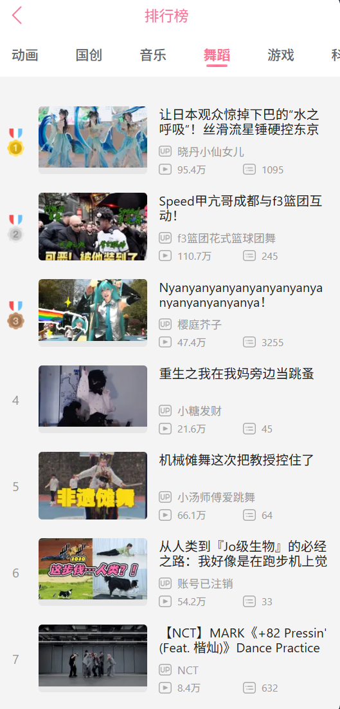
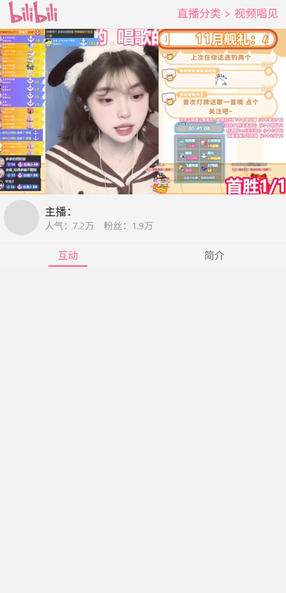

# BetterBilibiliWeb-Mobile
> **此项目仅供学习和交流，不得用于商业用途**

高仿B站web移动端

##
本项目基于此[SSR服务端渲染](https://github.com/dxx/react-ssr)模板，使用React，Typescript开发

## 技术点
* react
* react-router-dom
* react-router-config
* redux(数据管理)
* redux-thunk(支持异步Action)
* react-helmet(Head管理)
* react-lazyload(图片懒加载)
* loadable-components(代码分割)
* cross-fetch(浏览器和node通用的Fetch API)
* express(后端服务)

## 实现功能
* 首页
* 分类页
* 排行榜
* 搜索
* 视频详情页 
  1.视频播放 
  2.弹幕 
  3.推荐列表 
  4.评论列表
* UP主页 
  1.详情 
  2.投稿列表
* 个人中心 
  历史记录
* 直播
* 直播列表
* 分类
* 直播间 
  1.直播播放 
  2.聊天弹幕

## 运行

> 先运行服务端接口，见`bilibili-api`目录。本http服务默认端口: 3010

### `npm install`
安装项目依赖包

### `npm run dev`
运行开发环境

### `npm run build`
打包客户端和服务端，运行生产环境前必须先打包

### `npm run start`
运行生产环境

## 屏幕截图

  
  

  
  

  
  

  
  

